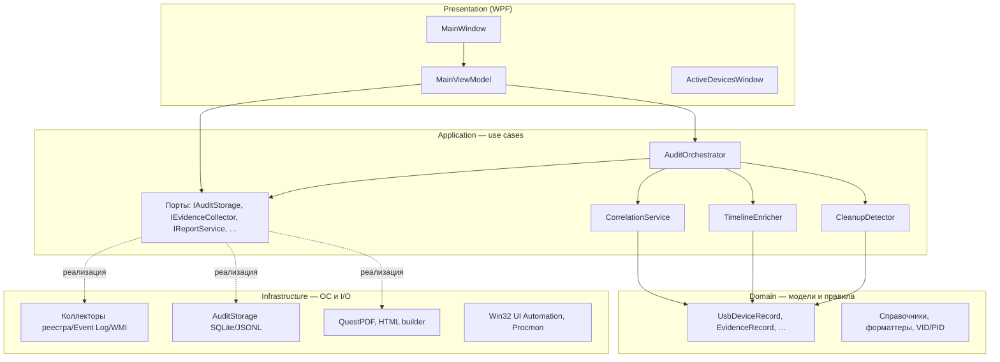

# UsbForensicAudit

GUI-first forensic-аудитор USB/Type-C устройств для **Windows 10/11**. Собирает артефакты из реестра, журналов событий и профилей пользователей, коррелирует их с устройствами, выявляет признаки очистки следов и формирует отчёты HTML/PDF/Excel.

Приложение ориентировано на аналитика/администратора: русский интерфейс, пояснения к каждой записи, portable-сборка для работы с флешки без следов в `%LOCALAPPDATA%`. **Запуск возможен только с правами администратора** (без UAC окно не откроется). Краткая сборка exe: [BUILD.md](BUILD.md).

---

## Содержание

- [Возможности](#возможности)
- [Требования](#требования)
- [Быстрый старт](#быстрый-старт)
- [Архитектура](#архитектура)
- [Структура решения](#структура-решения)
- [Конвейер сканирования](#конвейер-сканирования)
- [Presentation-слой (WPF + MVVM)](#presentation-слой-wpf--mvvm)
- [Хранение данных](#хранение-данных)
- [Сборка](#сборка)
- [Тестирование](#тестирование)
- [Вспомогательные утилиты (`tools/`)](#вспомогательные-утилиты-tools)
- [Расширение системы](#расширение-системы)
- [Ограничения и интерпретация](#ограничения-и-интерпретация)

---

## Возможности

### Сбор артефактов

| Источник | Что извлекается |
|---|---|
| Реестр `HKLM\SYSTEM\ControlSet*\Enum` | `USB`, `USBSTOR`, `SCSI`, `SWD\WPDBUSENUM` (все ControlSet) |
| PnP DevProperties `0064–0067` | точные даты первого/последнего подключения из реестра |
| Реестр `HKLM\SYSTEM\ControlSet*\Control\usbflags` | остаточные следы VID/PID (как USBTraceCleaner), база `Assets/USBVendors.txt` |
| Реестр `HKLM\SYSTEM\MountedDevices` | буквы дисков, VSN, GPT/MBR-сигнатуры, пути `USBSTOR` |
| `setupapi.dev.log` и архивы `setupapi.*.log` | история PnP/USB из SetupAPI (включая VSS-копии) |
| Event Log | `System`, `Security`, `Kernel-PnP`, `Storage-ClassPnP`, `Partition`, `WPD-MTP`, `DeviceSetupManager`, `DriverFrameworks-UserMode` |
| Endpoint Protection (если установлен) | корпоративные журналы контроля USB |
| Профили пользователей (`HKU`, offline hive) | `MountPoints2`, Recent, PIDL/MRU, LNK, Jump Lists, Shellbags, метаданные `$I` Recycle Bin |
| Execution artifacts | Prefetch, Amcache, Shimcache, PCA, BAM/DAM |
| Исторические источники | `DeviceMigration`, diff ControlSet, `Windows.old`, read-only VSS discovery, transaction-log provenance |
| Security 4688 | атрибуция процессов очистки (при включённом аудите) |

### Аналитика

- **Граф идентичности устройств** (`DeviceIdentityGraph`): канонический ID, ContainerID, composite `MI_xx`, защита от ложного слияния по VID/PID.
- **Корреляция томов** (`VolumeCorrelationService`): буквы дисков, VSN из LNK/Jump Lists, `MountedDevices`.
- **Классификация транспорта** (`DeviceTransportClassifier`): UASP/SCSI, MTP/WPD, USB4/Thunderbolt, хабы, встроенные/внешние/виртуальные.
- Корреляция **устройство → доказательство → пользовательский артефакт** с уровнем уверенности и `EvidenceStrength` (Direct / Corroborating / Indirect).
- Классификация записей: `RealUsb`, `RelatedStorage`, `UsbFlagsTrace`, `SupportArtifact`.
- **ScanCoverageReport**: статус каждого сборщика (Complete / Partial / Error / NotRun), лимиты, % устройств с точной датой в HTML/PDF/Excel.
- Двойной клик по строке на вкладке **USB устройства** — модальное окно с именем, датами, моделью, VID/PID и серийным номером.
- Расчёт дат подключения/отключения по PnP DevProperties, SetupAPI и только семантически подтверждённым Event Log/DLP-событиям; Kernel-PnP 411/420/430 и общие WPD/driver-события остаются corroborating и точную дату не устанавливают. User/execution artifacts используются только для корреляции. Все даты в GUI/отчётах — **МСК** (`дд.ММ.гггг ЧЧ:мм:сс МСК`).
- Поиск признаков очистки с атрибуцией: инициатор, возможный инструмент, уверенность, severity.
- Учёт даты установки Windows и **grace period 3 часа** после установки (события «Норма: ОС после установки»).
- Live-мониторинг USB/Type-C по **событиям PnP Windows** (без постоянного опроса каждые 2 секунды).
- Вкладка **«Сторонние утилиты»**: захват таблиц USBDetector/USBDeview, разбор строк, Procmon-трассировка реестра.
- Отчёты **HTML**, **PDF** и **Excel** (полный и сводный) на русском языке с корректной кириллицей. **Область отчёта — только USB/Type-C**; ОЗУ и внутренние SATA/NVMe исключены.

### Portable-режим

При запуске из записываемой папки (флешка, `bin\publish\`) все данные пишутся в `data\` рядом с exe. Procmon64 встроен в сборку и распаковывается при первом использовании.

---

## Требования

| Компонент | Версия |
|---|---|
| ОС | Windows 10 / 11 x64 |
| .NET SDK | 8.0+ |
| IDE (опционально) | Visual Studio 2022 (workload *Desktop development with .NET*) или JetBrains Rider |

Для полного сканирования, Procmon-трассировки и захвата сторонних утилит нужны **права администратора**. Приложение **не запускается** без UAC — при старте показывается предупреждение и процесс завершается (`App.xaml.cs`).

---

## Быстрый старт

### Разработческая сборка

```powershell
git clone https://github.com/DmitryFPS/UsbForensicAudit.git
cd UsbForensicAudit
dotnet build UsbForensicAudit.sln -c Release
```

Запуск:

```text
bin\Release\net8.0-windows\UsbForensicAudit.exe
```

### Portable single-file exe

См. также [BUILD.md](BUILD.md) — команды copy-paste.

```powershell
dotnet test tests\UsbForensicAudit.Tests\UsbForensicAudit.Tests.csproj -c Release
.\build-exe.ps1
```

Результат:

```text
bin\publish\UsbForensicAudit.exe
bin\publish\UsbForensicAudit_Инженерное_руководство.pdf
```

`UsbForensicAudit-Instrukciya.pdf` и `PORTABLE.txt` не создаются: правила запуска,
переносимости, архитектура и порядок интерпретации результатов описаны в инженерном
PDF-руководстве рядом с EXE.

### Типовой сценарий работы

1. Запустить exe **от имени администратора** (ПКМ → «Запуск от имени администратора»; без прав окно не откроется).
2. Нажать **«Полное сканирование»**.
3. Изучить вкладки **USB устройства**, **Доказательства**, **Следы очистки**.
4. При необходимости — **«Старт мониторинга»** и окно **«Окно USB»**.
5. На вкладке **Отчёт** — создать полный или сводный отчёт в PDF либо Excel.

**Цвета строк USB:**

| Цвет | Категория | Смысл |
|---|---|---|
| Зелёный | `RealUsb` | реальное USB/Type-C устройство |
| Жёлтый | `RelatedStorage` | связанная storage-запись (диск/том USB) |
| Фиолетовый | `UsbFlagsTrace` | остаточный след в `usbflags` (VID/PID) |
| Серый | `SupportArtifact` | служебная запись Windows |

---

## Архитектура

Проект следует **Clean Architecture** (слои + порты/адаптеры + DI). Зависимости направлены внутрь: Presentation → Application → Domain; Infrastructure реализует порты Application.



### Правила зависимостей

| Слой | Может ссылаться на | Не должен |
|---|---|---|
| **Domain** | только BCL / CodePages | Application, Infrastructure, WPF |
| **Application** | Domain | Infrastructure (только интерфейсы-порты) |
| **Infrastructure** | Application, Domain | Presentation |
| **Presentation** | все слои через DI | — |

Корневой namespace везде `UsbForensicAudit` — осознанное решение для минимизации churn при рефакторинге. Границы слоёв обеспечиваются `.csproj`-ссылками и `InternalsVisibleTo` для тестов.

### DI и точка входа

`App.xaml.cs` поднимает `Microsoft.Extensions.Hosting`:

```csharp
services.AddApplicationServices();      // CorrelationService, CleanupDetector, TimelineEnricher, AuditOrchestrator
services.AddInfrastructureServices();   // коллекторы, хранилище, отчёты, WMI
services.AddSingleton<MainViewModel>();
services.AddSingleton<MainWindow>();
```

`MainWindow` получает `MainViewModel` и платформенные сервисы через конструктор; `DataContext = MainViewModel`.

---

## Структура решения

```text
UsbForensicAudit/
├── UsbForensicAudit.sln          # Domain, Application, Infrastructure, Presentation
├── UsbForensicAudit.csproj       # WPF-приложение (Presentation)
├── MainWindow.xaml(.cs)          # View: разметка + тонкий code-behind (Win32, clipboard, Procmon UI)
├── MainViewModel.cs              # ViewModel: коллекции, состояние сканирования, порядок сортировки
├── ActiveDevicesWindow.xaml(.cs)  # Окно live-мониторинга
├── DeviceDetailsWindow.xaml(.cs)  # Модальное окно сведений об USB (двойной клик)
├── App.xaml(.cs)                 # Generic Host, DI, проверка админа, глобальные обработчики ошибок
├── build-exe.ps1                 # Portable publish + инженерное руководство + проверка Procmon
├── BUILD.md                      # Краткие команды сборки exe (copy-paste)
├── Assets/                       # Иконки, логотип, USBVendors.txt (embedded в Domain)
├── docs/                         # Проверенное инженерное PDF-руководство
├── src/
│   ├── UsbForensicAudit.Domain/           # Модели, справочники, форматтеры, парсеры
│   ├── UsbForensicAudit.Application/      # Use cases, оркестратор, порты, аналитика
│   └── UsbForensicAudit.Infrastructure/   # Коллекторы, SQLite, PDF, WMI, Win32, Procmon
├── tests/
│   └── UsbForensicAudit.Tests/            # xUnit, coverlet (322 теста)
└── tools/
    ├── GenerateIcon/                      # PNG → ICO для сборки
    ├── GenerateManual/                  # Отдельная legacy-утилита, в portable-сборке не запускается
    ├── MergeUsbVendorDatabase/            # Слияние usb.ids с локальной базой VID/PID
    └── ExternalUtilityHarness/            # Интеграционный harness захвата утилит
```

**Папки, которых нет в git** (создаются при сборке/работе): `bin/`, `obj/`, `obj/rid-out/`, `TestResults/`, `.idea/`.

---

## Конвейер сканирования

Центральный use case — `AuditOrchestrator.RunFullScanAsync`. Выполняется в фоне (`Task.Run`), прогресс отдаётся в UI через `IProgress<string>`.

```text
1. UsbRegistryCollector              → Devices (USB, USBSTOR, SCSI, WPD, usbflags, все ControlSet)
2. SetupApiLogCollector              → Evidence (+ архивы setupapi)
3. EventLogCollector                 → Evidence (Kernel-PnP, Storage-ClassPnP, Partition, MTP, …)
4. EndpointProtectionCollector       → Evidence (если ShouldRun)
5. UserArtifactCollector             → Evidence (PIDL, Shellbags, Jump Lists, Recycle Bin, …)
6. OfflineHiveCollector              → Evidence
7. ExecutionArtifactCollector        → Evidence (Prefetch, Amcache, Shimcache, PCA, BAM/DAM, …)
8. ProcessAttributionCollector       → Evidence
   → dedup user artifacts
9. HistoricalArtifactCollector       → Evidence (DeviceMigration, ControlSet diff, Windows.old, VSS)
10. LiveDeviceMerger                 → обогащение Devices
11. DeviceTransportClassifier        → транспорт/топология (UASP, MTP, USB4, …)
12. DeviceIdentityGraph              → канонический ID, ContainerID, composite
13. VolumeCorrelationService         → буквы дисков, VSN, MountedDevices
14. CorrelationService               → доп. Evidence (корреляции)
15. TimelineEnricher                 → даты, пояснения, WMI «подключено сейчас»
16. CalculateDateCoverage            → ScanCoverageReport.ExactDateCoveragePercent
17. CleanupDetector                  → CleanupFindings
18. AuditStorage.Save                → SQLite + JSONL (audit_sessions, hash-chain)
```

Порядок шагов 2–8 задаётся регистрацией `IEvidenceCollector` в `InfrastructureServiceCollectionExtensions` (порядок `AddSingleton` = порядок выполнения). Шаг 9 — отдельный порт `IHistoricalArtifactCollector`.

Ключевые порты Application (`Abstractions.cs`):

| Порт | Назначение |
|---|---|
| `IUsbDeviceCollector` | первый шаг — устройства из реестра |
| `IEvidenceCollector` | один источник доказательств; `ShouldRun` для условных сборщиков |
| `IAuditStorage` | персистентность результатов |
| `ILiveDeviceMerger` | слияние с live-устройствами |
| `IConnectedDeviceProbe` | WMI-проба «подключено сейчас» для TimelineEnricher |
| `IReportService` | HTML/PDF/Excel отчёты |
| `IPrivilegeChecker` | проверка прав администратора |
| `IExternalUtilityRegistryTracer` | live-трассировка реестра для сторонних утилит |

---

## Presentation-слой (WPF + MVVM)

| Компонент | Ответственность |
|---|---|
| `MainViewModel` | `ObservableCollection` для таблиц, `IsScanning` / `IsProcmonTracing`, `LastResult`, вызов `AuditOrchestrator`, сортировка результатов (`OrderDevices`, `OrderEvidence`, `OrderCleanupFindings`) |
| `MainWindow` | XAML-привязки `{Binding Devices}`, `{Binding Evidence}`, обработчики кнопок, Win32/clipboard, Procmon UI, обновление счётчиков и `DataGrid` |
| `ActiveDevicesWindow` | отдельное окно live-списка подключённых устройств |
| `DeviceDetailsWindow` | модальное окно: имя, подключение, последняя активность, модель, VID/PID, серийный номер |

Платформенный код (UI Automation, захват ListView, Procmon session folder) **намеренно** остаётся во View — это допустимый компромисс: бизнес-логика в нижних слоях, View — адаптер ОС.

---

## Хранение данных

### Portable (приоритет)

```text
{папка с UsbForensicAudit.exe}\data\
```

### Fallback (если рядом с exe нельзя писать)

```text
%LOCALAPPDATA%\UsbForensicAudit\
```

### Содержимое `data\`

| Файл / папка | Назначение |
|---|---|
| `audit.sqlite` | структурированное хранилище (`audit_sessions`, devices, evidence, cleanup) |
| `evidence.jsonl` | append-only журнал с SHA-256 hash-chain и provenance |
| `app.log` | технический лог приложения |
| `external_utility_snapshot.json` | снимок сторонней утилиты |
| `tools\Procmon64.exe` | распакованный Procmon (из embedded resource) |
| `procmon\{session}\` | CSV-трассировки Procmon |
| `UsbForensicAudit_*.html/pdf/xlsx` | сгенерированные отчёты |

Логика выбора каталога — `AppPaths` (Infrastructure).

---

## Сборка

Краткая инструкция (копировать-вставить): **[BUILD.md](BUILD.md)**.

### Dev-сборка (Rider / Visual Studio / CLI)

```powershell
dotnet build UsbForensicAudit.sln -c Release
```

Выход:

```text
bin\Release\net8.0-windows\UsbForensicAudit.exe
```

### Portable publish

```powershell
.\build-exe.ps1
```

Скрипт:

1. Проверяет/скачивает `tools\Procmon64.exe` (нужен интернет **только при сборке**).
2. Генерирует `Assets\app.ico` через `tools\GenerateIcon`.
3. Выполняет `dotnet publish` (single-file, self-contained, `win-x64`).
4. Копирует проверенное инженерное руководство из `docs\` рядом с EXE.
5. Проверяет, что Procmon встроен в `UsbForensicAudit.Infrastructure.dll`.

RID-сборка (`publish -r win-x64`) пишет промежуточные артефакты в `obj\rid-out\`, не затрагивая `bin\Release\` — это исключает конфликты блокировки DLL при параллельной работе IDE и скрипта.

**Если publish падает с «файл заблокирован»:** закройте запущенный `UsbForensicAudit.exe`, остановите Debug в Rider/VS, выполните `dotnet build-server shutdown`, повторите скрипт.

---

## Тестирование

```powershell
dotnet test tests\UsbForensicAudit.Tests\UsbForensicAudit.Tests.csproj -c Release
```

С покрытием:

```powershell
dotnet test tests\UsbForensicAudit.Tests\UsbForensicAudit.Tests.csproj --collect:"XPlat Code Coverage"
```

Конфигурация coverlet: `tests/UsbForensicAudit.Tests/coverlet.runsettings`.

**Стратегия покрытия:** unit-тесты на измеряемое ядро (парсеры, корреляции, Procmon CSV, ViewModel-сортировка, DI-регистрация) с порогом **≥ 90% line coverage** по включённым файлам. Исключены из метрики: WPF code-behind, коллекторы ОС, PDF-генераторы, WMI — они требуют интерактивной Windows-среды.

Примеры тестовых классов:

| Класс | Что проверяет |
|---|---|
| `UsbRegistryForensicHelpersTests`, `EventAndSetupApiParserTests` | PnP DevProperties, Event Log, SetupAPI |
| `Stage3IdentityAndVolumeTests` | граф идентичности, MountedDevices, VSN |
| `Stage4TransportClassificationTests` | UASP, MTP, USB4, хабы, встроенные |
| `Stage5HistoricalArtifactTests` | DeviceMigration, ControlSet, VSS provenance |
| `Stage6ForensicArtifactTests` | PIDL, Shimcache, SQLite round-trip, coverage |
| `Stage7IntegrationTests` | end-to-end orchestrator, golden fixture, отчёты |
| `CoreLogicTests`, `CorrelationServiceTests` | корреляция и ключевая логика |
| `ProcmonCsvParserTests`, `ProcmonCompletenessTests` | разбор Procmon |
| `ExternalUtilityTests`, `ExternalUtilityReportConclusionTests` | сторонние утилиты |
| `MainViewModelTests` | порядок сортировки результатов в VM |
| `ServiceRegistrationTests` | порядок сборщиков и WMI-probe в DI |
| `TimelineEnricherTests`, `TextSanitizerTests` | обогащение и нормализация текста |
| `UsbFlagsTests` | парсинг `usbflags`, категория `UsbFlagsTrace` |
| `ExcelReportTests` | PDF/Excel, структура листов, область отчёта |
| `ReportScopeTests` | USB-only фильтр в отчётах (исключение SATA/NVMe, ОЗУ) |

---

## Вспомогательные утилиты (`tools/`)

| Проект | Назначение |
|---|---|
| `GenerateIcon` | конвертация `Assets/app-icon.png` → `Assets/app.ico` |
| `MergeUsbVendorDatabase` | слияние `Assets/USBVendors.txt` с загруженным `usb.ids` |
| `ExternalUtilityHarness` | headless-тест захвата окон USBDeview/USBDetector |

Проверенное инженерное руководство хранится в `docs\UsbForensicAudit_Инженерное_руководство.pdf`;
`build-exe.ps1` проверяет его наличие и PDF-сигнатуру, затем помещает рядом с EXE.
Procmon на этапе сборки: `tools\Procmon64.exe` (в `.gitignore`; скачивается `build-exe.ps1` или кладётся вручную).

---

## Расширение системы

### Добавить новый источник доказательств

1. Реализовать `IEvidenceCollector` в `UsbForensicAudit.Infrastructure`.
2. Зарегистрировать в `InfrastructureServiceCollectionExtensions` **в нужном порядке**:
   ```csharp
   services.AddSingleton<IEvidenceCollector, MyNewCollector>();
   ```
3. Добавить unit-тесты на парсинг/нормализацию (без обращения к ОС, если возможно).

Оркестратор менять не нужно — он итерирует все зарегистрированные `IEvidenceCollector`.

### Добавить порт / адаптер

1. Интерфейс — в `UsbForensicAudit.Application`.
2. Реализация — в `UsbForensicAudit.Infrastructure`.
3. Регистрация — в `AddInfrastructureServices()` или `AddApplicationServices()`.

---

## Ограничения и интерпретация

- Приложение **не блокирует** USB — только анализирует и мониторит.
- PDF/Excel/HTML-отчёты включают **только USB/Type-C** и связанные forensic-артефакты; внутренние SATA/NVMe и ОЗУ в отчёты не попадают.
- **USB-C/Type-C порт ≠ гарантия USB-транспорта** — устройство может идти по PCIe/Thunderbolt; классификация помечает такие случаи как `PCIe-tunneled candidate`.
- **USB4/Thunderbolt** покрыт частично: внешние NVMe-контейнеры и dock-кандидаты включаются при наличии маркеров в реестре/WMI.
- **Deleted-cell carving** реестра не реализован; transaction logs дают provenance, но не полный replay удалённых ключей.
- **VSS** — только read-only discovery существующих снимков; снимки не создаются и не изменяются.
- SRUM и браузерные артефакты **не считаются прямым доказательством** подключения USB.
- Корпоративные политики DLP/Endpoint Protection могут скрывать стандартные следы Windows; программа использует дополнительные источники и помечает даты как ориентир.
- Windows **не всегда** сохраняет физический номер порта; показываются `LocationInformation` / `LocationPaths`, если ОС их отдала.
- Отсутствие артефакта ≠ факт очистки. Оценивайте findings в совокупности; на вкладке «Доказательства» и в отчётах смотрите `EvidenceStrength` и «Уверенность».
- **Grace period 3 часа** после установки Windows: очистка журналов ОС — норма, статус «Норма: ОС после установки».
- Security **4688** доступен только при включённом аудите создания процессов.
- Prefetch/Amcache фиксируют **запуск** утилиты, но не доказывают очистку в конкретную секунду.
- Offline-загрузка hive может не сработать для активного профиля; активные профили анализируются через загруженный `HKU`, ошибка попадает в warnings.
- Разные сборки Windows 10/11 дают разную детализацию Event Log; каждый collector изолирован — сбой одного не останавливает весь аудит.

---

## Автор

**Орлов Дмитрий Владимирович**
